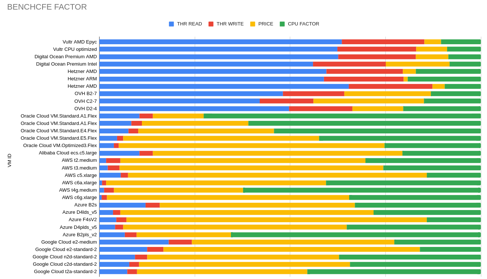

# The Benchcfe Factor

.

## Reference

Technically, the vms (instances) are evaluated by CPU, Read and Write Disk performance.
Additionally, the performance of the network between the virtual machine and 3 cloud servers is measured: Google Cloud, Aws, Azure and/or IBM as the case may be.

The process consists of three measurements 5 seconds apart and a fourth measurement that runs in parallel while running a bash Fibonacci sequence between 10 and 50000.

To avoid discrepancies, I have used 2 or more virtual machines per provider, indicating the type and flavor, while maintaining almost the same characteristics (if the provider offers that too):

    * 2 CPU / 4 GB RAM
    * 4 CPU / 8 GB RAM.

The machines were created from scratch and the only tasks they execute are those described in this benchmark.

## Providers included in the benchmark

    * Vultr
    * Digital Ocean
    * Hetzner x86_64
    * Hetzner ARM
    * OVH x86_64
    * Oracle x86_64
    * Oracle ARM
    * Alibaba Cloud x86_64
    * AWS x86_64
    * AWS ARM
    * Azure x86_64
    * Azure ARM
    * Google Cloud x86_64
    * Google Cloud ARM

## Initial Analysis

All the **virtual machines** (**VMs**) or **instances** have been selected based on their service promises and price (from the lowest to the highest), in addition to the fact that they had to maintain the basic structure (when possible and offered) of 2/4 and 4/8 .

In each instance only ssh access was enabled and when they had a small bootable disk capacity (like AWS), it just went up to 50 GB. No other additional modifications were made.

The purpose of this evaluation is to **compare the average cost of compute units based on processing power and disk read/write offered as standard**.

I am fully aware that several providers can increase the IOPS on disks when required but that will always imply a higher cost, so I am excluding it from the equation because the requirements can simply be variable and their costs are much higher only at that point.

The other key factor is the incoming and outgoing traffic, the **top** providers charge this according to the demand and the free traffic for the computing unit becomes very small therefore an additional cost is generated that according to the demand can take off enormously.

I'm omitting all the traditional aspects of **PAAS**, like load balancers, flexible ips, kubernetes, etc, etc... all those components make the solution even more expensive and can multiply by up to 10+ times the compute units themselves. For that, they can go to the relevant providers and have them size and cost their infrastructure, just remember that the more services they need, the prices not only increase a little more but are even enhanced.  **This is just a compute analysis cost and benchmarks**.

All the metrics ans results from the current tests are available for anyone [here](https://docs.google.com/spreadsheets/d/12DbzpJ058i90bfUvVVFQsrVR7IOyf-DnCIH-7lBFw-8/edit?usp=sharing)

The evidence (data* files) can be freely accessible [here](https://drive.google.com/drive/folders/13AVvSJh1lat3FHJdm5o5Cz6J32RN6LDf?usp=sharing) too

## Warning

The test presents a delay of more than 3 hours (actually some more than 5) in various **AWS** instances, which already indicates a performance problem. If someone has a **VM / instance in AWS**, I invite you to run the script so they can check it out.

## Update

I found the problem of the delay in the **AWS** instances, is generated when you want to measure the disk performance with a 16 GB file, which causes the read / write performance to go to the ground. This can be due to many reasons but basically associated with the provider, the overload of the VMs, the disk units or even a problem in the data center selected for the tests.
