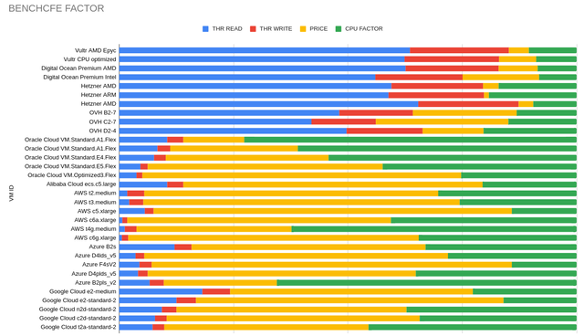

# Benchcfe - Cost for Efficiency Benchmark tool

.

## Description

Benchmark tool to measure the performance of various cloud providers and thus be able to obtain the **cost for efficiency** of each one according to the metrics of my previous [article](https://www.linkedin.com/pulse/hidden-cost-cloud-computing-alfonso-de-la-guarda-reyes).

## Tools

    * fio
    * sysbench
    * iperf3
    * bash script for primes generation

## Requirements

The script was develop and tested for Ubuntu 22.04, however you can easily adapt to any distro ( i am personally use #Manjaro which is #Arch based)

## Usage

Just clone the repository inside your instance (vm/bare metal) and run the **benchcfe.sh** script, after that in the project directory you will see that files have been generated that refer to each test, simply take those values to the referenced table at the end of the document so that the respective calculation of the cost for efficiency can be represented and graphed.

The **$HOSTNAME** variable is defined in the script and taken for the host name command in bash, the user does not need to define it or act on this variable, it will simply be part of each generated file to be able to clearly identify it.

The generated files start with the name **data_cpu_test_X_$HOSTNAME**, **data_disk_test_X_$HOSTNAME**, where **X** is the test number.

Also we will have some additional files **data_mixed_cpu_result_$HOSTNAME** and **data_mixed_disk_result_$HOSTNAME** those indicates the CPU and disk benchmarks meanwhile is running the prime generator script.

Finally we got also: **data_cpu_info_$HOSTNAME**, **data_mem_info_$HOSTNAME** and **data_disk_info_$HOSTNAME** which shows our full resources for each instance(vm/bare metal).

## Network benchmarks

The generation of the network test does not generate any files, it is done manually because it involves interacting with another host on another network, which is a security risk in an uncontrolled environment, in addition to adjusting firewalls and security rules per instance.

The measure of the benchmark is very simple in this case, you only install install **iperf3** put one host in server mode and another in client mode, as this:

    In the host: sudo iperf3 -s
    In the client: sudo iperf3 -c IP_FROM_HOST > data_network_CLOUD-PROVIDER-NAME

Note this: you need to check your firewall for this and adapt everything to allow the traffic to the port 5201

## Pro tip

To download the data_* files generated by the script I recommend using a simple scp, something like this:

    bash: scp USER@SERVER:/LOCATION/benchcfe/data* LOCAL_DIRECTORY
    zsh: scp USER@SERVER:/LOCATION/benchcfe/data\* LOCAL_DIRECTORY

Don't forget fill up the correspondent values according to the  report/template [spreadsheet](https://docs.google.com/spreadsheets/d/12DbzpJ058i90bfUvVVFQsrVR7IOyf-DnCIH-7lBFw-8/edit?usp=sharing) to generate the metrics

## Additional comments

I decided to develop this script and the corresponding table based on the private comments i received in relation to [my first article](https://www.linkedin.com/pulse/hidden-cost-cloud-computing-alfonso-de-la-guarda-reyes) where some traditional cloud providers did not get good metrics and criticized the model I developed, in this case I decided to test all vms and instances and equality of absolute conditions and in its different forms and flavors in such a way that there is no doubt about the **cost for efficiency** to which I refer.

I must also point out that computing power and its relation to cost is not the only factor that one considers for the implementation of a cloud solution, there are very important factors such as network storage, balancing, bonding, networking, security, auto scaling, redundancy, traffic, etc. However, almost all the costs of these services are directly related to the cost of the computing unit.

## Benchcfe Factor - First Multi Cloud Analysis

You can get the information about the the complete tests in [BENCHCFE TESTS](BENCHCFE_TESTS.md)

## References

### The bash script for primes

I got the bash script that generates the prime numbers from this [website](https://phoxis.org/2011/03/06/bash-script-generating-primes-within-range/), modifying some lines so that the initial and final values were static and did not ask me for the range.

## Contributors ✨

Alfonso de la Guarda [github](https://github.com/alfonsodg).

## License

**Benchcfe** is licensed under the GNU General Public License, Version 2. View a copy of the [License file](https://www.gnu.org/licenses/old-licenses/gpl-2.0.html).
